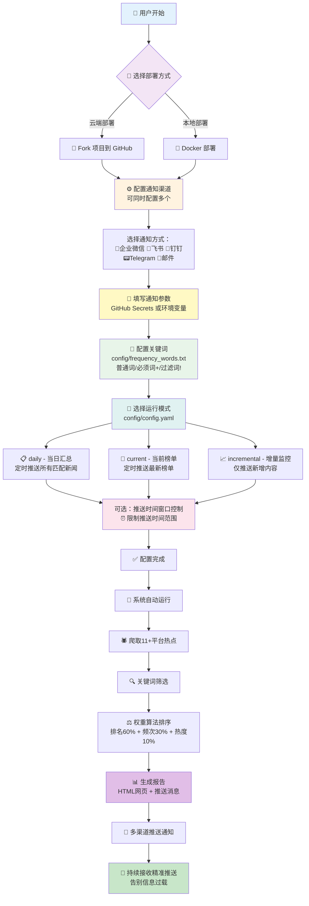

<div align="center" id="trendradar">

<a href="https://github.com/sansan0/TrendRadar" title="TrendRadar">
  
</a>

🚀 가장 빠른 <strong>30초</strong> 배포 핫이슈 도우미 —— 무의미한 스크롤 탈출, 진짜 관심 있는 뉴스만 보기

<a href="https://trendshift.io/repositories/14726" target="_blank"></a>

[](https://github.com/sansan0/TrendRadar/stargazers)
[](https://github.com/sansan0/TrendRadar/network/members)
[](LICENSE)
[](https://github.com/sansan0/TrendRadar)
[](https://github.com/sansan0/TrendRadar)

[](https://work.weixin.qq.com/)
[](https://telegram.org/)
[](#)
[](https://www.feishu.cn/)
[](#)
[](https://github.com/binwiederhier/ntfy)


[](https://github.com/sansan0/TrendRadar)
[](https://sansan0.github.io/TrendRadar)
[](https://hub.docker.com/r/wantcat/trendradar)
[](https://modelcontextprotocol.io/)

</div>


> 본 프로젝트는 경량화와 쉬운 배포를 목표로 합니다

## 📑 빠른 네비게이션

<div align="center">

| [🎯 핵심 기능](#-핵심-기능) | [🚀 빠른 시작](#-빠른-시작) | [🐳 Docker 배포](#-docker-배포) | [🤖 AI 분석 전용](#-ai-지능-분석-배포) |
|:---:|:---:|:---:|:---:|
| [📝 업데이트 로그](#-업데이트-로그) | [🔌 MCP 클라이언트](#-mcp-클라이언트) | [❓ Q&A 및 FAQ](#문제-답변-및-1원-후원) | [⭐ 프로젝트 관련](#프로젝트-관련) |
| [🔧 커스텀 모니터링 플랫폼](#커스텀-모니터링-플랫폼) | [📝 frequency_words.txt 설정](#frequencywordstxt-설정-가이드) | | |

</div>

- **버그를 끈기있게 피드백**해주신 기여자분들께 감사드립니다. 여러분의 모든 피드백이 프로젝트를 더욱 완벽하게 만들어줍니다😉;
- **프로젝트에 star를 주신** 여러분께 감사드립니다. **fork**도 좋고, **star**도 좋고, 둘 다 해주시면😍 오픈소스 정신에 대한 최고의 지지입니다;
- **[공식 계정](#문제-답변-및-1원-후원)을 팔로우**해주신 독자분들께 감사드립니다. 여러분의 댓글, 좋아요, 공유, 추천 등 적극적인 상호작용이 콘텐츠를 더욱 따뜻하게 만들어줍니다😎。  

<details>
<summary>👉 클릭하여 <strong>감사 명단</strong> 보기 (현재 <strong>🔥66🔥</strong> 명)</summary>

### 데이터 지원

본 프로젝트는 [newsnow](https://github.com/ourongxing/newsnow) 프로젝트에서 제공하는 API 인터페이스를 사용하여 다중 플랫폼 데이터를 가져옵니다

### 홍보 지원

> 다음 플랫폼과 개인의 추천에 감사드립니다 (시간순)

- [小众软件](https://mp.weixin.qq.com/s/fvutkJ_NPUelSW9OGK39aA) - 오픈소스 소프트웨어 추천 플랫폼
- [LinuxDo 커뮤니티](https://linux.do/) - 기술 애호가들의 모임
- [루이펑 주간](https://github.com/ruanyf/weekly) - 기술계의 영향력 있는 주간지

### 커뮤니티 지원

> **재정적 지원**을 해주신 분들께 감사드립니다. 여러분의 관대함은 키보드 옆의 간식과 음료로 변신하여 프로젝트의 모든 반복 작업을 함께하고 있습니다

|           후원자            |  금액  |  날짜  |             비고             |
| :-------------------------: | :----: | :----: | :-----------------------: |
|           *海          |  1  | 2025.11.15  |    | 
|           *德          |  1.99  | 2025.11.15  |    | 
|           *疏          |  8.8  | 2025.11.14  |  오픈소스에 감사, 프로젝트 훌륭해요, 응원합니다   |
|           M*e          |  10  | 2025.11.14  |  오픈소스 쉽지 않죠, 고생하셨어요   |
|           **柯          |  1  | 2025.11.14  |     |
|           *云          |  88  | 2025.11.13  |    좋은 프로젝트, 오픈소스에 감사  |
|           *W          |  6  | 2025.11.13  |      |
|           *凯          |  1  | 2025.11.13  |      |
|           对*.          |  1  | 2025.11.13  |    Thanks for your TrendRadar  |
|           s*y          |  1  | 2025.11.13  |      |
|           **翔          |  10  | 2025.11.13  |   좋은 프로젝트, 이제야 알게 되어 아쉽네요, 오픈소스에 감사!     |
|           *韦          |  9.9  | 2025.11.13  |   TrendRadar 최고예요, 선생님께 커피 한 잔~     |
|           h*p          |  5  | 2025.11.12  |   중국 오픈소스를 응원합니다, 화이팅!     |
|           c*r          |  6  | 2025.11.12  |        |
|           a*n          |  5  | 2025.11.12  |        |
|           。*c          |  1  | 2025.11.12  |    오픈소스 공유에 감사    |
|           *记          |  1  | 2025.11.11  |        |
|           *主          |  1  | 2025.11.10  |        |
|           *了          |  10  | 2025.11.09  |        |
|           *杰          |  5  | 2025.11.08  |        |
|           *点          |  8.80  | 2025.11.07  |   개발 쉽지 않죠, 응원합니다.     |
|           Q*Q          |  6.66  | 2025.11.07  |   오픈소스에 감사!     |
|           C*e          |  1  | 2025.11.05  |        |
|           Peter Fan          |  20  | 2025.10.29  |        |
|           M*n          |  1  | 2025.10.27  |      오픈소스에 감사  |
|           *许          |  8.88  | 2025.10.23  |      선생님 초보인데 며칠 동안 해봐도 안 되네요, 도와주세요  |
|           Eason           |  1  | 2025.10.22  |      아직 잘 모르겠지만, 좋은 일 하시네요  |
|           P*n           |  1  | 2025.10.20  |          |
|           *杰           |  1  | 2025.10.19  |          |
|           *徐           |  1  | 2025.10.18  |          |
|           *志           |  1  | 2025.10.17  |          |
|           *😀           |  10  | 2025.10.16  |     좋아요     |
|           **杰           |  10  | 2025.10.16  |          |
|           *啸           |  10  | 2025.10.16  |          |
|           *纪           |  5  | 2025.10.14  | TrendRadar         |
|           J*d           |  1  | 2025.10.14  | 도구 감사해요, 재미있네요...          |
|           *H           |  1  | 2025.10.14  |           |
|           那*O           |  10  | 2025.10.13  |           |
|           *圆           |  1  | 2025.10.13  |           |
|           P*g           |  6  | 2025.10.13  |           |
|           Ocean           |  20  | 2025.10.12  |  ...정말 훌륭해요!!! 초보도 바로 쓸 수 있어요...         |
|           **培           |  5.2  | 2025.10.2  |  github-yzyf1312:오픈소스 만세         |
|           *椿           |  3  | 2025.9.23  |  화이팅, 아주 좋아요         |
|           *🍍           |  10  | 2025.9.21  |           |
|           E*f           |  1  | 2025.9.20  |           |
|           *记            |  1  | 2025.9.20  |           |
|           z*u            |  2  | 2025.9.19  |           |
|           **昊            |  5  | 2025.9.17  |           |
|           *号            |  1  | 2025.9.15  |           |
|           T*T            |  2  | 2025.9.15  |  좋아요         |
|           *家            |  10  | 2025.9.10  |           |
|           *X            |  1.11  | 2025.9.3  |           |
|           *飙            |  20  | 2025.8.31  |  노동으로부터 감사합니다         |
|           *下            |  1  | 2025.8.30  |           |
|           2*D            |  88  | 2025.8.13 오후 |           |
|           2*D            |  1  | 2025.8.13 오전 |           |
|           S*o            |  1  | 2025.8.05 |   응원합니다        |
|           *侠            |  10  | 2025.8.04 |           |
|           x*x            |  2  | 2025.8.03 |  trendRadar 좋은 프로젝트 좋아요          |
|           *远            |  1  | 2025.8.01 |            |
|           *邪            |  5  | 2025.8.01 |            |
|           *梦            |  0.1  | 2025.7.30 |            |
|           **龙            |  10  | 2025.7.29 |      응원합니다      |


</details>


## ✨ 핵심 기능

### **전체 네트워크 핫이슈 집계**

- 知乎 (지후 - 중국 Q&A 플랫폼)
- 抖音 (더우인 - 중국판 TikTok)
- bilibili 핫 검색
- 华尔街见闻 (월스트리트 차이나)
- 贴吧 (티에바 - 바이두 커뮤니티)
- 百度热搜 (바이두 핫 검색)
- 财联社热门 (차이렌서 핫 뉴스)
- 澎湃新闻 (펑파이 뉴스)
- 凤凰网 (펑황왕 - 피닉스 뉴스)
- 今日头条 (진르터우탸오 - 바이트댄스 뉴스)
- 微博 (웨이보 - 중국판 트위터)

기본적으로 11개의 주요 플랫폼을 모니터링하며, 추가 플랫폼도 직접 추가할 수 있습니다

<details id="커스텀-모니터링-플랫폼">
<summary><strong>👉 클릭하여 펼치기: 커스텀 모니터링 플랫폼</strong></summary>
<br>

본 프로젝트의 뉴스 데이터는 [newsnow](https://github.com/ourongxing/newsnow) 프로젝트에서 제공하는 데이터를 사용합니다. [웹사이트](https://newsnow.busiyi.world/)를 클릭하고 [더보기]를 클릭하여 원하는 플랫폼이 있는지 확인할 수 있습니다.

구체적인 추가 방법은 [프로젝트 소스 코드](https://github.com/ourongxing/newsnow/tree/main/server/sources)를 방문하여 파일명을 확인한 후, `config/config.yaml` 파일에서 `platforms` 설정을 수정하세요:

```yaml
platforms:
  - id: "toutiao"
    name: "진르터우탸오"
  - id: "baidu"
    name: "바이두 핫 검색"
  - id: "wallstreetcn-hot"
    name: "월스트리트 차이나"
  # 더 많은 플랫폼 추가...
```
잘 모르겠다면 다른 사용자가 정리한 [플랫폼 설정](https://github.com/sansan0/TrendRadar/issues/95)을 직접 복사하세요

</details>

### **스마트 푸시 전략**

**세 가지 푸시 모드**:

| 모드 | 적용 대상 | 푸시 시기 | 표시 내용 | 적용 시나리오 |
|------|----------|----------|----------|----------|
| **당일 요약**<br/>`daily` | 📋 기업 관리자/일반 사용자 | 정시 푸시(기본 1시간마다) | 당일 모든 매칭 뉴스<br/>+ 신규 뉴스 영역 | 일일 요약<br/>당일 핫이슈 트렌드 전체 파악 |
| **현재 랭킹**<br/>`current` | 📰 미디어인/콘텐츠 크리에이터 | 정시 푸시(기본 1시간마다) | 현재 랭킹 매칭 뉴스<br/>+ 신규 뉴스 영역 | 실시간 핫이슈 추적<br/>현재 가장 인기있는 콘텐츠 파악 |
| **증분 모니터링**<br/>`incremental` | 📈 투자자/트레이더 | 신규 항목만 푸시 | 새로 등장한 매칭 키워드 뉴스 | 중복 정보 간섭 방지<br/>고빈도 모니터링 시나리오 |

**추가 기능 - 푸시 시간 윈도우 제어** (선택사항):

이 기능은 위의 세 가지 푸시 모드와 독립적이며, 모든 모드와 함께 사용할 수 있습니다:

- **시간 윈도우 제한**: 푸시 시간 범위 설정 (예: 09:00-18:00 또는 20:00-22:00), 지정된 시간에만 푸시
- **푸시 빈도 제어**:
  - 윈도우 내 다중 푸시: 시간 윈도우 내에서 매번 실행 시 푸시
  - 하루 한 번만 푸시: 시간 윈도우 내에서 한 번만 푸시 (당일 요약 또는 현재 랭킹 모드에 적합)
- **일반적인 시나리오**:
  - 근무 시간 푸시: 평일 09:00-18:00에만 메시지 수신
  - 저녁 요약 푸시: 저녁 고정 시간 (예: 20:00-22:00)에 요약 수신
  - 방해 방지: 비근무 시간에 푸시 알림 수신 방지

> 팁: 이 기능은 기본적으로 비활성화되어 있으며, `config/config.yaml`에서 수동으로 `push_window.enabled`를 활성화해야 합니다

### **정밀 콘텐츠 필터링**

개인 키워드 설정 (예: AI, BYD, 교육 정책), 관련 핫이슈만 푸시하고 무관한 정보 필터링

- 일반 단어, 필수 단어(+), 필터 단어(!) 세 가지 구문 지원, 【frequency_words.txt 설정 가이드】 참조
- 그룹화 관리, 다양한 주제 핫이슈 독립 통계

> 필터링하지 않고 모든 핫이슈를 완전히 푸시할 수도 있습니다. 자세한 내용은 【업데이트 기록】의 v2.0.1 참조

<details id="frequencywordstxt-설정-가이드">
<summary><strong>👉 클릭하여 펼치기: frequency_words.txt 설정 가이드</strong></summary>
<br>

`frequency_words.txt` 파일에서 모니터링할 키워드를 설정하며, 세 가지 구문과 그룹 기능을 지원합니다.

키워드가 앞에 있을수록 뉴스의 우선순위가 높아지므로, 관심도에 따라 키워드 순서를 조정할 수 있습니다

| 구문 유형 | 기호 | 역할 | 예시 | 매칭 로직 |
|---------|------|------|------|---------|
| **일반 단어** | 없음 | 기본 매칭 | `화웨이` | 하나라도 포함하면 됨 |
| **필수 단어** | `+` | 범위 제한 | `+스마트폰` | 동시에 포함해야 함 |
| **필터 단어** | `!` | 간섭 배제 | `!광고` | 포함시 직접 제외 |

### 📋 기본 구문 설명

#### 1. **일반 키워드** - 기본 매칭
```txt
화웨이
OPPO
애플
```
**역할:** 뉴스 제목에 **하나라도 포함**되면 캡처됨

#### 2. **필수 단어** `+단어` - 범위 제한
```txt
화웨이
OPPO
+스마트폰
```
**역할:** 일반 단어**와** 필수 단어를 **동시에 포함**해야 캡처됨

#### 3. **필터 단어** `!단어` - 간섭 배제
```txt
애플
화웨이
!과일
!가격
```
**역할:** 필터 단어가 포함된 뉴스는 키워드가 포함되어 있어도 **직접 제외**됨

### 🔗 그룹 기능 - 빈 줄 구분의 중요성

**핵심 규칙:** **빈 줄**로 다른 그룹을 구분하며, 각 그룹은 독립적으로 통계 처리됩니다

#### 예시 설정:
```txt
iPhone
삼성
LG
+출시

코스피
코스닥
+등락
!예측

월드컵
유로
아시안컵
+경기
```

#### 그룹 설명 및 매칭 효과:

**제1그룹 - 스마트폰 신제품:**
- 키워드: iPhone, 삼성, LG
- 필수 단어: 출시
- 효과: 스마트폰 브랜드명과 "출시"를 동시에 포함해야 함

**매칭 예시:**
- ✅ "iPhone 15 정식 출시 가격 공개" ← "iPhone"+"출시" 포함
- ✅ "삼성 갤럭시 S24 시리즈 출시 발표회" ← "삼성"+"출시" 포함
- ✅ "LG 신제품 출시 시기 확정" ← "LG"+"출시" 포함
- ❌ "iPhone 판매량 신기록" ← "iPhone" 있지만 "출시" 없음

**제2그룹 - 주식 시황:**
- 키워드: 코스피, 코스닥
- 필수 단어: 등락
- 필터 단어: 예측
- 효과: 주식 관련 단어와 "등락"을 포함하되, "예측"이 포함된 내용은 제외

**매칭 예시:**
- ✅ "코스피 오늘 대폭 등락 분석" ← "코스피"+"등락" 포함
- ✅ "코스닥 지수 등락 원인 해설" ← "코스닥"+"등락" 포함
- ❌ "전문가 예측 코스피 등락 추세" ← "코스피"+"등락" 있지만 "예측" 포함
- ❌ "코스피 거래량 신기록" ← "코스피" 있지만 "등락" 없음

**제3그룹 - 축구 경기:**
- 키워드: 월드컵, 유로, 아시안컵
- 필수 단어: 경기
- 효과: 대회명과 "경기"를 동시에 포함해야 함

**매칭 예시:**
- ✅ "월드컵 조별리그 경기 결과" ← "월드컵"+"경기" 포함
- ✅ "유로 결승전 경기 시간" ← "유로"+"경기" 포함
- ❌ "월드컵 티켓 판매 시작" ← "월드컵" 있지만 "경기" 없음

### 🎯 설정 기법

#### 1. **관대에서 엄격으로의 설정 전략**
```txt
# 1단계: 먼저 넓은 키워드로 테스트
인공지능
AI
ChatGPT

# 2단계: 오매칭 발견 후, 필수 단어 추가
인공지능
AI
ChatGPT
+기술

# 3단계: 방해 콘텐츠 발견 후, 필터 단어 추가
인공지능
AI
ChatGPT
+기술
!광고
!교육
```

#### 2. **과도한 복잡성 피하기**
❌ **권장하지 않음:** 하나의 그룹에 너무 많은 단어 포함
```txt
삼성
LG
애플
화웨이
샤오미
OPPO
vivo
+스마트폰
+출시
+판매량
!가짜
!수리
!중고
```

✅ **권장:** 여러 개의 정확한 그룹으로 분리
```txt
삼성
LG
+신제품

애플
화웨이
+출시

스마트폰
판매량
+시장
```

</details>


### **핫이슈 트렌드 분석**

뉴스 인기도 변화를 실시간으로 추적하여, "무엇이 핫 검색인지"뿐만 아니라 "핫이슈가 어떻게 진화하는지"도 파악할 수 있습니다

- **타임라인 추적**: 각 뉴스가 처음 등장한 시점부터 마지막 등장까지의 완전한 시간 범위 기록
- **인기도 변화**: 다양한 시간대의 순위 변화와 등장 빈도 통계
- **신규 감지**: 새로 등장한 핫이슈 토픽을 실시간으로 식별하여 🆕 마크로 즉시 알림
- **지속성 분석**: 일회성 핫이슈 토픽과 지속적으로 발효되는 심층 뉴스 구분
- **크로스 플랫폼 비교**: 동일한 뉴스의 다양한 플랫폼에서의 순위 성능을 통해 미디어 관심도 차이 파악

> 중요한 뉴스의 완전한 발전 과정을 더 이상 놓치지 마세요. 토픽의 초기 단계부터 정점까지 전체를 파악하세요

<details>
<summary><strong>👉 클릭하여 펼치기: 푸시 형식 설명</strong></summary>
<br>

📊 핫이슈 키워드 통계

🔥 [1/3] AI ChatGPT : 2건

  1. [바이두 핫 검색] 🆕 ChatGPT-5 정식 출시 [**1**] - 09시15분 (1회)

  2. [진르터우탸오] AI 칩 관련주 급등 [**3**] - [08시30분 ~ 10시45분] (3회)

━━━━━━━━━━━━━━━━━━━

📈 [2/3] BYD 테슬라 : 2건

  1. [웨이보] 🆕 BYD 월 판매량 신기록 [**2**] - 10시20분 (1회)

  2. [더우인] 테슬라 가격 인하 프로모션 [**4**] - [07시45분 ~ 09시15분] (2회)

━━━━━━━━━━━━━━━━━━━

📌 [3/3] A주 주식시장 : 1건

  1. [월스트리트 차이나] A주 오전 시황 분석 [**5**] - [11시30분 ~ 12시00분] (2회)

🆕 이번에 새로 추가된 핫이슈 뉴스 (총 2건)

**바이두 핫 검색** (1건):
  1. ChatGPT-5 정식 출시 [**1**]

**웨이보** (1건):
  1. BYD 월 판매량 신기록 [**2**]

업데이트 시간: 2025-01-15 12:30:15


## **메시지 형식 설명**

| 형식 요소      | 예시                        | 의미         | 설명                                    |
| ------------- | --------------------------- | ------------ | --------------------------------------- |
| 🔥📈📌        | 🔥 [1/3] AI ChatGPT        | 인기도 등급     | 🔥고인기도(≥10건) 📈중인기도(5-9건) 📌일반 인기도(<5건) |
| [순서/총수]   | [1/3]                       | 정렬 위치     | 모든 매칭된 그룹 중 현재 그룹의 순위          |
| 빈도 그룹      | AI ChatGPT                  | 키워드 그룹     | 설정 파일의 그룹, 제목에 해당 단어 포함 필수   |
| : N건        | : 2건                      | 매칭 수량     | 해당 그룹에 매칭된 뉴스 총 개수                    |
| [플랫폼명]      | [바이두 핫 검색]                  | 출처 플랫폼     | 뉴스가 속한 플랫폼 이름                      |
| 🆕            | 🆕 ChatGPT-5 정식 출시        | 신규 표시     | 이번 크롤링에서 처음 등장한 핫이슈                |
| [**숫자**]    | [**1**]                     | 높은 순위       | 순위≤임계값인 핫 검색, 빨강 굵게 표시           |
| [숫자]        | [7]                         | 일반 순위     | 순위>임계값인 핫 검색, 일반 표시               |
| - 시간        | - 09시15분                  | 최초 시간     | 해당 뉴스를 처음 발견한 시간                  |
| [시간~시간]   | [08시30분 ~ 10시45분]       | 지속 시간     | 처음 등장부터 마지막 등장까지의 시간 범위          |
| (N회)         | (3회)                       | 등장 빈도     | 모니터링 기간 동안 등장한 총 횟수                  |
| **신규 영역**  | 🆕 **이번에 새로 추가된 핫이슈 뉴스**      | 신규 토픽 요약   | 이번 라운드에 새로 등장한 핫이슈 토픽을 별도 표시            |

</details>


### **개인화 핫이슈 알고리즘**

더 이상 각 플랫폼의 알고리즘에 끌려다니지 마세요. TrendRadar는 전체 네트워크의 핫 검색을 재정리합니다:

- **높은 순위의 뉴스 중시** (60%): 각 플랫폼의 상위 뉴스를 우선 표시
- **지속적으로 등장하는 토픽 주목** (30%): 반복적으로 등장하는 뉴스가 더 중요
- **순위 품질 고려** (10%): 여러 번 등장할 뿐만 아니라 자주 상위권에 랭크

> 다양한 플랫폼에 분산된 핫 검색을 병합하여 관심도에 따라 재정렬합니다. 이 세 가지 비율은 자신의 시나리오에 맞게 조정할 수 있습니다

<details>
<summary><strong>👉 클릭하여 펼치기: 핫이슈 가중치 조정</strong></summary>
<br>

현재 기본 설정은 균형잡힌 설정입니다

### 두 가지 핵심 시나리오

**실시간 핫이슈 추적형**:
```yaml
weight:
  rank_weight: 0.8    # 주로 순위 중시
  frequency_weight: 0.1  # 지속성은 크게 신경쓰지 않음
  hotness_weight: 0.1
```
**적합한 사용자**: 미디어 블로거, 마케팅 담당자, 현재 가장 인기있는 주제를 빠르게 파악하고 싶은 사용자

**심층 토픽 추적형**:
```yaml
weight:
  rank_weight: 0.4    # 순위를 적당히 고려
  frequency_weight: 0.5  # 당일 지속적인 인기도 중시
  hotness_weight: 0.1
```
**적합한 사용자**: 투자자, 연구원, 언론인, 트렌드를 심층 분석해야 하는 사용자

### 조정 방법
1. **세 숫자의 합은 반드시 1.0이어야 함**
2. **중요한 것을 크게 조정**: 순위가 중요하면 rank_weight를 높이고, 지속성이 중요하면 frequency_weight를 높임
3. **한 번에 0.1-0.2씩만 조정하여** 효과 관찰

핵심 사고방식: 속도와 시의성을 추구하는 사용자는 순위 가중치를 높이고, 깊이와 안정성을 추구하는 사용자는 빈도 가중치를 높입니다.

</details>

### **다중 채널 실시간 푸시**

**기업 위챗**(+ 위챗 푸시 방안), **Feishu**, **DingTalk**, **Telegram**, **이메일**, **ntfy** 지원, 메시지가 휴대폰과 이메일로 직접 전달됩니다

### **다중 단말 적응**
- **GitHub Pages**: 정교한 웹 리포트 자동 생성, PC/모바일 최적화
- **Docker 배포**: 멀티 아키텍처 컨테이너화 실행 지원
- **데이터 영속화**: HTML/TXT 다중 형식 히스토리 기록 저장


### **AI 스마트 분석 (v3.0.0 신규 추가)**

MCP (Model Context Protocol) 프로토콜 기반 AI 대화 분석 시스템으로 자연어를 사용하여 뉴스 데이터를 심층 분석할 수 있습니다

- **대화형 쿼리**: 자연어로 질문 가능, 예: "어제 Zhihu의 핫이슈 조회", "비트코인 최근 인기도 추세 분석"
- **13가지 분석 도구**: 기본 쿼리, 스마트 검색, 트렌드 분석, 데이터 인사이트, 감정 분석 등 포함
- **다중 클라이언트 지원**: Cherry Studio(GUI 설정), Claude Desktop, Cursor, Cline 등
- **심층 분석 기능**:
  - 주제 트렌드 추적(인기도 변화, 생명주기, 폭발적 인기 감지, 트렌드 예측)
  - 크로스 플랫폼 데이터 비교(활성도 통계, 키워드 공동 출현)
  - 스마트 요약 생성, 유사 뉴스 검색, 히스토리 연관 검색

> 데이터 파일을 수동으로 뒤적이는 시대는 끝났습니다. AI 어시스턴트가 뉴스 이면의 스토리를 즉시 이해하도록 도와줍니다

### **제로 기술 문턱 배포**

GitHub에서 원클릭 Fork만으로 사용 가능, 프로그래밍 기초 불필요.

> 30초 배포: GitHub Pages(웹 브라우징) 원클릭 이미지 저장 지원, 언제든지 타인과 공유
>
> 1분 배포: 기업 위챗(휴대폰 알림)

**💡 팁:** **실시간 업데이트** 웹 버전을 원하시나요? fork 후 리포지토리의 Settings → Pages에서 GitHub Pages를 활성화하세요. [효과 미리보기](https://sansan0.github.io/TrendRadar/).

### **앱 의존도 감소**

"알고리즘 추천에 묶이는 것"에서 "원하는 정보를 주도적으로 얻는 것"으로

**적합한 사용자:** 투자자, 자미디어인, 기업 PR, 시사에 관심있는 일반 사용자

**전형적인 시나리오:** 주식 투자 모니터링, 브랜드 여론 추적, 업계 동향 주목, 생활 정보 획득


| Github Pages 효과(모바일 최적화, 이메일 푸시 효과) | Feishu 푸시 효과 |
|:---:|:---:|
|  |  |


## 📝 업데이트 로그

>**업그레이드 설명**:
- **팁**: **Sync fork**를 통해 본 프로젝트를 업데이트하지 마세요. 【업데이트 기록】을 확인하여 구체적인 【업그레이드 방법】과 【기능 내용】을 명확히 하세요
- **마이너 버전 업데이트**: v2.x에서 v2.y로 업그레이드 시, 본 프로젝트의 `main.py` 코드로 fork 리포지토리의 해당 파일을 교체하세요
- **메이저 버전 업그레이드**: v1.x에서 v2.y로 업그레이드 시, 기존 fork를 삭제한 후 다시 fork하는 것을 권장합니다. 이렇게 하면 더 간편하고 설정 충돌을 피할 수 있습니다


### 2025/11/12 - v3.0.5

- 이메일 전송 SSL/TLS 포트 설정 로직 오류 수정
- 이메일 서비스 제공업체(QQ/163/126) 기본 465 포트(SSL) 사용 최적화
- **Docker 환경 변수 지원 추가**: 핵심 설정 항목(`enable_crawler`, `report_mode`, `push_window` 등)이 환경 변수를 통한 오버라이드 지원, NAS 사용자의 설정 파일 수정 미적용 문제 해결([🐳 Docker 배포](#-docker-부署) 섹션 참조)


### 2025/10/26 - mcp-v1.0.1

  **MCP 모듈 업데이트:**
  - 날짜 쿼리 파라미터 전달 오류 수정
  - 모든 도구의 시간 파라미터 형식 통일


<details>
<summary><strong>👉 클릭하여 펼치기: 히스토리 업데이트</strong></summary>


### 2025/10/31 - v3.0.4

- Feishu 푸시 콘텐츠 과다로 인한 오류 해결, 배치 푸시 구현


### 2025/10/23 - v3.0.3

- ntfy 오류 정보 표시 범위 확대


### 2025/10/21 - v3.0.2

- ntfy 푸시 인코딩 문제 수정

### 2025/10/20 - v3.0.0

**중대 업데이트 - AI 분석 기능 출시** 🤖

- **핵심 기능**:
  - MCP (Model Context Protocol) 기반 AI 분석 서버 신규 추가
  - 13가지 스마트 분석 도구 지원: 기본 쿼리, 스마트 검색, 고급 분석, 시스템 관리
  - 자연어 상호작용: 대화 방식으로 뉴스 데이터 쿼리 및 분석
  - 다중 클라이언트 지원: Claude Desktop, Cherry Studio, Cursor, Cline 등

- **분석 능력**:
  - 주제 트렌드 분석(인기도 추적, 생명주기, 폭발적 인기 감지, 트렌드 예측)
  - 데이터 인사이트(플랫폼 비교, 활성도 통계, 키워드 공동 출현)
  - 감정 분석, 유사 뉴스 검색, 스마트 요약 생성
  - 히스토리 관련 뉴스 검색, 다중 모드 검색

- **업데이트 팁**:
  - 독립적인 AI 분석 기능으로 기존 푸시 기능에 영향 없음
  - 선택적 사용 가능, 기존 배포 업그레이드 불필요


### 2025/10/15 - v2.4.4

- **업데이트 내용**:
    - ntfy 푸시 인코딩 문제 수정 + 1
    - 푸시 시간 윈도우 판단 문제 수정

- **업데이트 팁**:
  - [마이너 버전 업그레이드] 권장


### 2025/10/10 - v2.4.3

> [nidaye996](https://github.com/sansan0/TrendRadar/issues/98)이 발견한 사용 경험 문제에 감사드립니다

- **업데이트 내용**:
    - "사일런트 푸시 모드" 이름을 "푸시 시간 윈도우 제어"로 리팩토링하여 기능 이해도 향상
    - 푸시 시간 윈도우를 선택 가능한 추가 기능으로 명확화, 세 가지 푸시 모드와 조합 사용 가능
    - 주석 및 문서 설명 개선으로 기능 포지셔닝 명확화

- **업데이트 팁**:
  - 단순 리팩토링이므로 업그레이드 선택 사항


### 2025/10/8 - v2.4.2

- **업데이트 내용**:
    - ntfy 푸시 인코딩 문제 수정
    - 설정 파일 누락 문제 수정
    - ntfy 푸시 효과 최적화
    - github page 이미지 분할 내보내기 기능 추가

- **업데이트 팁**:
  - [메이저 버전 업데이트] 권장


### 2025/10/2 - v2.4.0

**ntfy 푸시 알림 신규 추가**

- **핵심 기능**:
  - ntfy.sh 공용 서비스 및 셀프 호스팅 서버 지원

- **사용 시나리오**:
  - 프라이버시를 중시하는 사용자에게 적합(셀프 호스팅 지원)
  - 크로스 플랫폼 푸시(iOS, Android, Desktop, Web)
  - 계정 등록 불필요(공용 서버)
  - 오픈소스 무료(MIT 라이선스)

- **업데이트 팁**:
  - [메이저 버전 업데이트] 권장


### 2025/09/26 - v2.3.2

- 이메일 알림 설정 확인 누락 문제 수정([#88](https://github.com/sansan0/TrendRadar/issues/88))

**수정 설명**:
- 이메일 알림을 올바르게 설정했음에도 시스템이 "webhook 미설정" 메시지를 표시하는 문제 해결

### 2025/09/22 - v2.3.1

- **이메일 푸시 기능 신규 추가**, 핫이슈 뉴스 리포트를 이메일로 전송 지원
- **스마트 SMTP 인식**: Gmail, QQ메일, Outlook, 넷이즈메일 등 10+ 이메일 서비스 제공업체 설정 자동 인식
- **HTML 정교한 형식**: 이메일 콘텐츠는 웹 버전과 동일한 HTML 형식 사용, 정교한 레이아웃, 모바일 최적화
- **일괄 전송 지원**: 여러 수신자 지원, 쉼표로 구분하여 동시에 여러 명에게 전송 가능
- **사용자 정의 SMTP**: SMTP 서버 및 포트 사용자 정의 가능
- Docker 빌드 네트워크 연결 문제 수정

**사용 설명**:
- 적용 시나리오: 이메일 아카이빙, 팀 공유, 정기 리포트가 필요한 사용자에게 적합
- 지원 이메일: Gmail, QQ메일, Outlook/Hotmail, 163/126메일, 신랑메일, 소후메일 등

**업데이트 팁**:
- 이번 업데이트 내용이 상당히 많으므로, 업그레이드 시 [메이저 버전 업그레이드] 권장

### 2025/09/17 - v2.2.0

- 원클릭 뉴스 이미지 저장 기능 신규 추가, 관심 핫이슈를 손쉽게 공유

**사용 설명**:
- 적용 시나리오: 튜토리얼에 따라 웹 버전 기능을 활성화한 후(GitHub Pages)
- 사용 방법: 휴대폰이나 컴퓨터로 웹 페이지 링크 열기, 페이지 상단의 "이미지로 저장" 버튼 클릭
- 실제 효과: 시스템이 자동으로 현재 뉴스 리포트를 정교한 이미지로 제작하여 휴대폰 앨범이나 컴퓨터 데스크톱에 저장
- 공유 편의성: 이 이미지를 친구에게 직접 보내거나, SNS에 게시하거나, 업무 그룹에 공유하여 다른 사람도 중요한 정보를 볼 수 있도록 함

### 2025/09/13 - v2.1.2

- DingTalk 푸시 용량 제한으로 인한 뉴스 푸시 실패 문제 해결(배치 푸시 방식 채택)

### 2025/09/04 - v2.1.1

- 특정 아키텍처에서 docker가 정상 실행되지 않는 문제 수정
- 공식 Docker 이미지 wantcat/trendradar 정식 출시, 멀티 아키텍처 지원
- Docker 배포 프로세스 최적화, 로컬 빌드 없이 빠른 사용 가능

### 2025/08/30 - v2.1.0

**핵심 개선**:
- **푸시 로직 최적화**: "매번 실행 시 푸시"에서 "시간 윈도우 내 제어 가능한 푸시"로 변경
- **시간 윈도우 제어**: 푸시 시간 범위 설정 가능, 비업무 시간 방해 방지
- **푸시 빈도 선택 가능**: 시간대 내 단일 푸시 또는 다중 푸시 지원

**업데이트 팁**:
- 이 기능은 기본적으로 비활성화되어 있으며, config.yaml에서 푸시 시간 윈도우 제어를 수동으로 활성화해야 함
- 업그레이드 시 main.py와 config.yaml 두 파일 모두 업데이트 필요

### 2025/08/27 - v2.0.4

- 이번 버전은 기능 수정이 아닌 중요 알림입니다
- webhooks를 안전하게 보관해야 하며, 공개하지 마세요, 공개하지 마세요, 공개하지 마세요
- fork 방식으로 본 프로젝트를 GitHub에 배포하는 경우, webhooks를 config.yaml이 아닌 GitHub Secret에 입력하세요
- 이미 webhooks를 노출했거나 config.yaml에 입력한 경우, 삭제 후 재생성을 권장합니다

### 2025/08/06 - v2.0.3

- github page 웹 버전 효과 최적화, 모바일 사용 편의성 향상

### 2025/07/28 - v2.0.2

- 코드 리팩토링
- 버전 번호가 수정 누락되기 쉬운 문제 해결

### 2025/07/27 - v2.0.1

**문제 수정**:

1. docker의 shell 스크립트 줄바꿈 문자가 CRLF로 인한 실행 오류 문제
2. frequency_words.txt가 비어있을 때 뉴스 전송도 비어있게 되는 로직 문제
  - 수정 후, frequency_words.txt를 비워두면 **모든 뉴스를 푸시**하지만, 메시지 푸시 크기 제한으로 인해 다음과 같이 조정하세요
    - 방안 1: 휴대폰 푸시 비활성화, Github Pages 배포만 선택(가장 완전한 정보를 얻을 수 있는 방안으로, 모든 플랫폼의 핫이슈를 **사용자 정의 핫서치 알고리즘**에 따라 재정렬)
    - 방안 2: 푸시 플랫폼 축소, **기업 위챗** 또는 **Telegram** 우선 선택, 이 두 플랫폼에 배치 푸시 기능 구현(배치 푸시가 푸시 경험에 영향을 주지만, 이 두 플랫폼만 약간의 푸시 용량만 제공하므로 어쩔 수 없이 배치 푸시 기능을 구현했으나, 최소한 정보 완전성은 보장)
    - 방안 3: 방안 2와 결합 가능, 모드를 current 또는 incremental로 선택하면 일회성 푸시 콘텐츠를 효과적으로 줄일 수 있음 

### 2025/07/17 - v2.0.0

**중대 리팩토링**:
- 설정 관리 리팩토링: 모든 설정은 이제 `config/config.yaml` 파일을 통해 관리(main.py는 여전히 분할하지 않아 복사 업그레이드가 편리함)
- 실행 모드 업그레이드: 세 가지 모드 지원 - `daily`(당일 요약), `current`(현재 랭킹), `incremental`(증분 모니터링)
- Docker 지원: 완전한 Docker 배포 방안, 컨테이너화 실행 지원

**설정 파일 설명**:
- `config/config.yaml` - 메인 설정 파일(애플리케이션 설정, 크롤러 설정, 알림 설정, 플랫폼 설정 등)
- `config/frequency_words.txt` - 키워드 설정(모니터링 단어 설정)

### 2025/07/09 - v1.4.1

**기능 신규 추가**: 증분 푸시 추가(main.py 헤더에서 FOCUS_NEW_ONLY 설정), 이 스위치는 지속적인 인기도가 아닌 새로운 주제만 관심 두며, 새로운 콘텐츠가 있을 때만 알림 전송.

**문제 수정**: 일부 경우 뉴스 자체에 특수 기호가 포함되어 발생하는 간헐적 레이아웃 오류.

### 2025/06/23 - v1.3.0

기업 위챗과 Telegram의 푸시 메시지에는 길이 제한이 있어, 메시지를 분할하여 푸시하는 방식을 채택했습니다. 개발 문서는 [기업 위챗](https://developer.work.weixin.qq.com/document/path/91770) 및 [Telegram](https://core.telegram.org/bots/api) 참조

### 2025/06/21 - v1.2.1

본 버전 이전의 구버전에서는 main.py뿐만 아니라 crawler.yml도 복사 교체가 필요합니다
https://github.com/sansan0/TrendRadar/blob/master/.github/workflows/crawler.yml

### 2025/06/19 - v1.2.0

> claude research가 정리한 각 플랫폼 api에 감사드립니다. 덕분에 각 플랫폼 적응을 빠르게 완료할 수 있었습니다(코드가 더 중복되긴 했지만~

1. telegram, 기업 위챗, DingTalk 푸시 채널 지원, 다중 채널 설정 및 동시 푸시 지원

### 2025/06/18 - v1.1.0

> **200 star⭐** 달성, 여러분과 함께 축하합니다~ 최근 제 "권유" 덕분에 많은 분들이 공식 계정에서 좋아요, 공유, 추천으로 저를 도와주셨고, 백엔드에서 구체적인 계정별 응원 데이터를 모두 확인했습니다. 많은 분들이 엔젤 라운드 팬이 되셨네요(공식 계정을 시작한 지 한 달 남짓이지만, 등록은 7~8년 전이라 일찍 탔지만 늦게 출발한 셈입니다). 하지만 댓글이나 개인 메시지를 남기지 않으셔서 일일이 답변하고 감사 인사를 드릴 수 없었습니다. 이 자리를 빌려 함께 감사드립니다!

1. 중요한 업데이트, 가중치 추가, 이제 보이는 뉴스는 가장 핫하고 주목도가 높은 것이 맨 위에 표시됩니다
2. 문서 사용 업데이트, 최근 많은 기능을 업데이트했고, 이전 사용 문서는 제가 간단하게 작성했기 때문입니다(아래 ⚙️ frequency_words.txt 설정 완전 튜토리얼 참조)

### 2025/06/16 - v1.0.0

1. 프로젝트 새 버전 업데이트 알림 추가, 기본적으로 활성화, 비활성화하려면 main.py에서 "FEISHU_SHOW_VERSION_UPDATE": True의 True를 False로 변경

### 2025/06/13+14

1. 호환성 코드 제거, 이전에 fork한 사용자가 코드를 직접 복사하면 당일 이상 표시됨(다음날 정상 복구)
2. feishu 및 html 하단에 신규 뉴스 표시 추가

### 2025/06/09

**100 star⭐** 달성, 여러분을 위해 작은 기능을 작성합니다
frequency_words.txt 파일에 [필수 단어] 기능 추가, + 기호 사용

1. 필수 단어 문법:
   당승 또는 저팔계가 제목에 동시에 나타나야 푸시 뉴스에 수록됨

```
+당승
+저팔계
```

2. 필터 단어의 우선순위가 더 높음:
   제목의 필터 단어가 "당승염경"과 매칭되면, 필수 단어에 당승이 있어도 표시되지 않음

```
+당승
!당승염경
```

### 2025/06/02

1. **웹페이지** 및 **Feishu 메시지**가 휴대폰에서 뉴스 상세로 직접 이동 지원
2. 표시 효과 최적화 + 1

### 2025/05/26

1. Feishu 메시지 표시 효과 최적화

<table>
<tr>
<td align="center">
최적화 전<br>

</td>
<td align="center">
최적화 후<br>

</td>
</tr>
</table>

</details>


## 🚀 빠른 시작

> 설정 완료 후 뉴스 데이터는 1시간 후에 업데이트됩니다. 빠르게 진행하고 싶다면 【4단계】를 참조하여 설정 효과를 수동으로 테스트하세요

1. **본 프로젝트를 Fork**하여 GitHub 계정으로

   - 본 페이지 오른쪽 상단의 "Fork" 버튼 클릭

2. **GitHub Secrets 설정(필요한 플랫폼 선택)**:

   Fork한 리포지토리에서 `Settings` > `Secrets and variables` > `Actions` > `New repository secret`로 이동하여, 필요에 따라 다음 중 하나 이상의 알림 플랫폼을 설정합니다:

   여러 플랫폼을 동시에 설정할 수 있으며, 시스템은 설정된 모든 플랫폼으로 알림을 전송합니다.

   효과는 아래 이미지와 유사합니다. 하나의 name이 하나의 secret에 대응하며, 저장하면 됩니다. 재편집 시 secret이 보이지 않는 것은 정상입니다. 

   


   <details>
   <summary> <strong>👉 클릭하여 펼치기: 기업 위챗 봇</strong>(설정이 가장 간단하고 빠름)</summary>
   <br>

   **GitHub Secret 설정:**
   - 이름: `WEWORK_WEBHOOK_URL`
   - 값: 기업 위챗 봇 Webhook 주소

   <br>

   **봇 설정 단계:**

   #### 모바일 설정:
   1. 기업 위챗 앱 열기 → 대상 내부 그룹 채팅 입장
   2. 오른쪽 상단 "…" 버튼 클릭 → "메시지 푸시" 선택
   3. "추가" 클릭 → 이름에 "TrendRadar" 입력
   4. Webhook 주소 복사, 저장 클릭, 복사한 내용을 위의 GitHub Secret에 설정

   #### PC 설정 절차도 유사함
   </details>

   <details>
   <summary> <strong>👉 클릭하여 펼치기: Feishu 봇</strong>(메시지 표시가 가장 친화적)</summary>
   <br>

   **GitHub Secret 설정:**
   - 이름: `FEISHU_WEBHOOK_URL`
   - 값: Feishu 봇 Webhook 주소(이 링크는 https://www.feishu.cn/flow/api/trigger-webhook/******** 와 유사하게 시작)
   <br>

   두 가지 방안이 있으며, **방안 1**은 설정이 간단하고, **방안 2**는 설정이 복잡합니다(하지만 안정적인 푸시)

   방안 1은 **ziventian**이 발견하고 제안한 것으로, 여기서 감사드립니다. 기본은 개인 푸시이며, 그룹 푸시 작업도 설정 가능합니다[#97](https://github.com/sansan0/TrendRadar/issues/97) ,

   **방안 1:**

   > 일부 사용자에게 추가 작업이 필요할 수 있으며, 그렇지 않으면 "시스템 오류"가 발생합니다. 모바일에서 봇을 검색한 다음 Feishu 봇 애플리케이션을 활성화해야 합니다(이 제안은 네티즌으로부터 나온 것으로 참고할 수 있음)

   1. 컴퓨터 브라우저에서 https://botbuilder.feishu.cn/home/my-command 열기

   2. "새 봇 명령 생성" 클릭

   3. "트리거 선택" 클릭, 아래로 스크롤, "Webhook 트리거" 클릭

   4. 이때 "Webhook 주소"가 표시됩니다. 이 링크를 로컬 메모장에 임시 복사하고 다음 작업을 계속합니다

   5. "파라미터"에 아래 내용을 입력한 다음 "완료" 클릭

   ```json
   {
     "message_type": "text",
     "content": {
       "total_titles": "{{内容}}",
       "timestamp": "{{内容}}",
       "report_type": "{{内容}}",
       "text": "{{内容}}"
     }
   }
   ```

   6. "작업 선택" > "공식 봇을 통해 메시지 보내기" 클릭

   7. 메시지 제목에 "TrendRadar 핫이슈 모니터링" 입력

   8. 가장 중요한 부분입니다. + 버튼 클릭, "Webhook 트리거" 선택, 아래 이미지에 따라 배치

   

   9. 설정 완료 후, 4단계에서 복사한 Webhook 주소를 GitHub Secrets의 `FEISHU_WEBHOOK_URL`에 설정

   <br>

   **방안 2:**

   1. 컴퓨터 브라우저에서 https://botbuilder.feishu.cn/home/my-app 열기

   2. "새 봇 애플리케이션 생성" 클릭

   3. 생성된 애플리케이션에 진입한 후, "프로세스 설계" > "프로세스 생성" > "트리거 선택" 클릭

   4. 아래로 스크롤, "Webhook 트리거" 클릭

   5. 이때 "Webhook 주소"가 표시됩니다. 이 링크를 로컬 메모장에 임시 복사하고 다음 작업을 계속합니다

   6. "파라미터"에 아래 내용을 입력한 다음 "완료" 클릭

   ```json
   {
     "message_type": "text",
     "content": {
       "total_titles": "{{内容}}",
       "timestamp": "{{内容}}",
       "report_type": "{{内容}}",
       "text": "{{内容}}"
     }
   }
   ```

   7. "작업 선택" > "Feishu 메시지 보내기" 클릭, "그룹 메시지" 체크, 아래 입력 상자 클릭, "내가 관리하는 그룹" 클릭(그룹이 없으면 Feishu 앱에서 그룹 생성 가능)

   8. 메시지 제목에 "TrendRadar 핫이슈 모니터링" 입력

   9. 가장 중요한 부분입니다. + 버튼 클릭, "Webhook 트리거" 선택, 아래 이미지에 따라 배치

   

   10. 설정 완료 후, 5단계에서 복사한 Webhook 주소를 GitHub Secrets의 `FEISHU_WEBHOOK_URL`에 설정

   </details>

   <details>
   <summary> <strong>👉 클릭하여 펼치기: DingTalk 봇</strong></summary>
   <br>

   **GitHub Secret 설정:**
   - 이름: `DINGTALK_WEBHOOK_URL`
   - 값: DingTalk 봇 Webhook 주소

   <br>

   **봇 설정 단계:**

   1. **봇 생성(PC만 지원)**:
      - DingTalk PC 클라이언트 열기, 대상 그룹 채팅 입장
      - 그룹 설정 아이콘(⚙️) 클릭 → 아래로 스크롤하여 "봇" 찾아서 열기
      - "봇 추가" → "사용자 정의" 선택

   2. **봇 설정**:
      - 봇 이름 설정
      - **보안 설정**:
        - **사용자 정의 키워드**: "핫이슈" 설정

   3. **설정 완료**:
      - 서비스 약관 동의 체크 → "완료" 클릭
      - 획득한 Webhook URL 복사
      - URL을 GitHub Secrets의 `DINGTALK_WEBHOOK_URL`에 설정

   **참고**: 모바일은 메시지 수신만 가능하며, 새 봇 생성은 불가능합니다.
   </details>

   <details>
   <summary> <strong>👉 클릭하여 펼치기: Telegram Bot</strong></summary>
   <br>

   **GitHub Secret 설정:**
   - 이름: `TELEGRAM_BOT_TOKEN` - Telegram Bot Token
   - 이름: `TELEGRAM_CHAT_ID` - Telegram Chat ID

   <br>

   **봇 설정 단계:**

   1. **봇 생성**:
      - Telegram에서 `@BotFather` 검색(대소문자 주의, 파란색 인증 배지 있음, 약 37849827 monthly users 표시, 이것이 공식이며, 일부 모방 계정이 있으니 주의)
      - `/newbot` 명령어 전송하여 새 봇 생성
      - 봇 이름 설정(반드시 "bot"으로 끝나야 하며, 중복 이름이 자주 발생하므로 독특한 이름을 고민해야 함)
      - Bot Token 획득(형식 예: `123456789:AAHfiqksKZ8WmR2zSjiQ7_v4TMAKdiHm9T0`)

   2. **Chat ID 획득**:

      **방법 1: 공식 API를 통해 획득**
      - 먼저 봇에게 메시지 전송
      - 방문: `https://api.telegram.org/bot<Bot Token>/getUpdates`
      - 반환된 JSON에서 `"chat":{"id":숫자}` 중 숫자 찾기

      **방법 2: 서드파티 도구 사용**
      - `@userinfobot` 검색하여 `/start` 전송
      - 사용자 ID를 Chat ID로 사용

   3. **GitHub에 설정**:
      - `TELEGRAM_BOT_TOKEN`: 1단계에서 획득한 Bot Token 입력
      - `TELEGRAM_CHAT_ID`: 2단계에서 획득한 Chat ID 입력
   </details>

   <details>
   <summary> <strong>👉 클릭하여 펼치기: 이메일 푸시</strong>(모든 주류 이메일 지원)</summary>
   <br>

   - 주의사항: 이메일 대량 발송 기능의 **남용**을 방지하기 위해, 현재 대량 발송은 모든 수신자가 서로의 이메일 주소를 볼 수 있습니다.
   - 아래와 같은 이메일 발송 설정 경험이 없다면, 시도하지 않는 것을 권장합니다

   <br>

   **GitHub Secret 설정:**
   - 이름: `EMAIL_FROM` - 발신자 이메일 주소
   - 이름: `EMAIL_PASSWORD` - 이메일 비밀번호 또는 인증 코드
   - 이름: `EMAIL_TO` - 수신자 이메일 주소(여러 수신자는 영문 쉼표로 구분) EMAIL_FROM과 동일하게 자신에게 발송 가능
   - 이름: `EMAIL_SMTP_SERVER` - SMTP 서버 주소(선택 사항, 비워두면 자동 인식)
   - 이름: `EMAIL_SMTP_PORT` - SMTP 포트(선택 사항, 비워두면 자동 인식)

   <br>

   **지원되는 이메일 서비스 제공업체**(SMTP 설정 자동 인식):

   | 이메일 서비스 | 도메인 | SMTP 서버 | 포트 | 암호화 방식 |
   |-----------|------|------------|------|---------|
   | **Gmail** | gmail.com | smtp.gmail.com | 587 | TLS |
   | **QQ메일** | qq.com | smtp.qq.com | 465 | SSL |
   | **Outlook** | outlook.com | smtp-mail.outlook.com | 587 | TLS |
   | **Hotmail** | hotmail.com | smtp-mail.outlook.com | 587 | TLS |
   | **Live** | live.com | smtp-mail.outlook.com | 587 | TLS |
   | **163메일** | 163.com | smtp.163.com | 465 | SSL |
   | **126메일** | 126.com | smtp.126.com | 465 | SSL |
   | **신랑메일** | sina.com | smtp.sina.com | 465 | SSL |
   | **소후메일** | sohu.com | smtp.sohu.com | 465 | SSL |

   > **자동 인식**: 위의 이메일 사용 시, `EMAIL_SMTP_SERVER` 및 `EMAIL_SMTP_PORT`를 수동으로 설정할 필요 없으며, 시스템이 자동으로 인식합니다.
   >
   > **피드백 설명**:
   > - **다른 이메일**로 테스트에 성공하면, [Issues](https://github.com/sansan0/TrendRadar/issues)를 열어 알려주세요. 지원 목록에 추가하겠습니다
   > - 위의 이메일 설정이 잘못되었거나 사용할 수 없는 경우에도 [Issues](https://github.com/sansan0/TrendRadar/issues)로 피드백을 주시면 프로젝트 개선에 도움이 됩니다

   **일반적인 이메일 설정:**

   #### QQ메일:
   1. QQ메일 웹 버전 로그인 → 설정 → 계정
   2. POP3/SMTP 서비스 활성화
   3. 인증 코드 생성(16자리 문자)
   4. `EMAIL_PASSWORD`에 인증 코드 입력, QQ 비밀번호 아님

   #### Gmail:
   1. 2단계 인증 활성화
   2. 앱 전용 비밀번호 생성
   3. `EMAIL_PASSWORD`에 앱 전용 비밀번호 입력

   #### 163/126메일:
   1. 웹 버전 로그인 → 설정 → POP3/SMTP/IMAP
   2. SMTP 서비스 활성화
   3. 클라이언트 인증 코드 설정
   4. `EMAIL_PASSWORD`에 인증 코드 입력
   <br>

   **고급 설정**:
   자동 인식 실패 시, SMTP를 수동으로 설정 가능:
   - `EMAIL_SMTP_SERVER`: 예: smtp.gmail.com
   - `EMAIL_SMTP_PORT`: 예: 587(TLS) 또는 465(SSL)
   <br>

   **여러 수신자가 있는 경우(영문 쉼표로 구분 주의)**:
   - EMAIL_TO="user1@example.com,user2@example.com,user3@example.com"

   </details>

   <details>
   <summary> <strong>👉 클릭하여 펼치기: ntfy 푸시</strong>(오픈소스 무료, 셀프 호스팅 지원)</summary>
   <br>

   **두 가지 사용 방법:**

   ### 방법 1: 무료 사용(초보자 권장) 🆓

   **특징**:
   - ✅ 계정 등록 불필요, 즉시 사용
   - ✅ 하루 250개 메시지(90% 사용자에게 충분)
   - ✅ Topic 이름이 "비밀번호"(추측하기 어려운 이름 선택 필요)
   - ⚠️ 메시지 암호화 안 됨, 민감 정보에 부적합하나, 본 프로젝트의 비민감 정보에는 적합

   **빠른 시작:**

   1. **ntfy 앱 다운로드**:
      - Android: [Google Play](https://play.google.com/store/apps/details?id=io.heckel.ntfy) / [F-Droid](https://f-droid.org/en/packages/io.heckel.ntfy/)
      - iOS: [App Store](https://apps.apple.com/us/app/ntfy/id1625396347)
      - 데스크톱: [ntfy.sh](https://ntfy.sh) 방문

   2. **주제 구독**(추측하기 어려운 이름 선택):
      ```
      권장 형식: trendradar-{이름 이니셜}-{랜덤 숫자}

      중국어 사용 불가

      ✅ 좋은 예: trendradar-zs-8492
      ❌ 나쁜 예: news, alerts(너무 쉽게 추측됨)
      ```

   3. **GitHub Secret 설정**:
      - `NTFY_TOPIC`: 방금 구독한 주제 이름 입력
      - `NTFY_SERVER_URL`: 비워두기(기본값으로 ntfy.sh 사용)
      - `NTFY_TOKEN`: 비워두기

   4. **테스트**:
      ```bash
      curl -d "테스트 메시지" ntfy.sh/주제이름
      ```

   ---

   ### 방법 2: 셀프 호스팅(완전한 프라이버시 제어) 🔒

   **적합한 사용자**: 서버 보유, 완전한 프라이버시 추구, 기술 능력 우수

   **장점**:
   - ✅ 완전 오픈소스(Apache 2.0 + GPLv2)
   - ✅ 데이터 완전 자주 제어
   - ✅ 어떠한 제한도 없음
   - ✅ 제로 비용

   **Docker 원클릭 배포**:
   ```bash
   docker run -d \
     --name ntfy \
     -p 80:80 \
     -v /var/cache/ntfy:/var/cache/ntfy \
     binwiederhier/ntfy \
     serve --cache-file /var/cache/ntfy/cache.db
   ```

   **TrendRadar 설정**:
   ```yaml
   NTFY_SERVER_URL: https://ntfy.yourdomain.com
   NTFY_TOPIC: trendradar-alerts  # 셀프 호스팅은 간단한 이름 사용 가능
   NTFY_TOKEN: tk_your_token  # 선택 사항: 액세스 제어 활성화
   ```

   **앱에서 구독**:
   - "Use another server" 클릭
   - 서버 주소 입력
   - 주제 이름 입력
   - (선택 사항) 로그인 자격 증명 입력

   ---

   **자주 묻는 질문:**

   <details>
   <summary><strong>Q1: 무료 버전으로 충분한가요?</strong></summary>

   하루 250개 메시지는 대부분의 사용자에게 충분합니다. 30분마다 한 번씩 크롤링한다고 계산하면, 하루 약 48회 푸시로 완전히 충분합니다.
   </details>

   <details>
   <summary><strong>Q2: Topic 이름이 정말 안전한가요?</strong></summary>

   랜덤하고 충분히 긴 이름을 선택하면(예: `trendradar-zs-8492-news`), 무차별 대입 공격은 거의 불가능합니다:
   - ntfy는 엄격한 속도 제한이 있음(1초에 1회 요청)
   - 64개 문자 선택지(A-Z, a-z, 0-9, _, -)
   - 10자리 랜덤 문자열은 64^10가지 가능성(해독에 수년 소요)
   </details>

   ---

   **권장 선택:**

   | 사용자 유형 | 권장 방안 | 이유 |
   |---------|---------|------|
   | 일반 사용자 | 방법 1(무료) | 간단하고 빠르며 충분함 |
   | 기술 사용자 | 방법 2(셀프 호스팅) | 완전 제어, 무제한 |
   | 고빈도 사용자 | 방법 3(유료) | 공식 웹사이트 참조 |

   **관련 링크:**
   - [ntfy 공식 문서](https://docs.ntfy.sh/)
   - [셀프 호스팅 튜토리얼](https://docs.ntfy.sh/install/)
   - [GitHub 리포지토리](https://github.com/binwiederhier/ntfy)

   </details>

   > **💡 초보자 빠른 시작 권장**:
   >
   > 첫 배포 시, 먼저 **GitHub Secrets** 설정을 완료하고(푸시 플랫폼 하나만 선택), 그런 다음 바로 [4단계]로 이동하여 푸시 성공 여부를 테스트하세요.
   >
   > **임시로 수정하지 마세요** `config/config.yaml`과 `frequency_words.txt`, 푸시 테스트 성공 후 필요에 따라 이러한 설정을 조정하세요.


3. **설정 설명**:

    - **푸시 설정**: [config/config.yaml](config/config.yaml)에서 푸시 모드 및 알림 옵션 설정
    - **키워드 설정**: [config/frequency_words.txt](config/frequency_words.txt)에 관심 키워드 추가
    - **푸시 빈도 조정**: [.github/workflows/crawler.yml](.github/workflows/crawler.yml)에서 신중하게 조정, 욕심 부리지 마세요

    **주의**: 문서에서 명확하게 설명된 설정 항목만 조정할 것을 권장합니다. 다른 옵션은 주로 저자의 개발 테스트용입니다

4. **뉴스 푸시 수동 테스트**:

    여기서는 제 프로젝트를 예로 들었으며, 여러분은 **fork**한 프로젝트에서 테스트해야 합니다

    1. **Actions 진입**: https://github.com/sansan0/TrendRadar/actions
    2. "Hot News Crawler"를 찾아 클릭, 해당 문구가 보이지 않으면 [#109](https://github.com/sansan0/TrendRadar/issues/109) 참조하여 해결
    3. "Run workflow" 버튼 클릭하여 실행, 약 1분 후 데이터가 휴대폰으로 전송됨


## 🐳 Docker 배포

#### 방법 1: 빠른 체험(한 줄 명령)

**Linux/macOS 시스템:**
```bash
# 설정 디렉토리 생성 및 설정 파일 다운로드
mkdir -p config output
wget https://raw.githubusercontent.com/sansan0/TrendRadar/master/config/config.yaml -P config/
wget https://raw.githubusercontent.com/sansan0/TrendRadar/master/config/frequency_words.txt -P config/
```
또는 **수동 생성**:
1. 현재 디렉토리에 `config` 폴더 생성
2. 설정 파일 다운로드:
   - https://raw.githubusercontent.com/sansan0/TrendRadar/master/config/config.yaml 방문 → 마우스 우클릭 "다른 이름으로 저장" → `config\config.yaml`로 저장
   - https://raw.githubusercontent.com/sansan0/TrendRadar/master/config/frequency_words.txt 방문 → 마우스 우클릭 "다른 이름으로 저장" → `config\frequency_words.txt`로 저장

완료 후 디렉토리 구조:
```
현재 디렉토리/
└── config/
    ├── config.yaml
    └── frequency_words.txt
```

```bash
docker run -d --name trend-radar \
  -v ./config:/app/config:ro \
  -v ./output:/app/output \
  -e FEISHU_WEBHOOK_URL="Feishu webhook" \
  -e DINGTALK_WEBHOOK_URL="DingTalk webhook" \
  -e WEWORK_WEBHOOK_URL="기업 위챗 webhook" \
  -e TELEGRAM_BOT_TOKEN="telegram_bot_token" \
  -e TELEGRAM_CHAT_ID="telegram_chat_id" \
  -e EMAIL_FROM="발신자 이메일" \
  -e EMAIL_PASSWORD="이메일 비밀번호 또는 인증 코드" \
  -e EMAIL_TO="수신자 이메일" \
  -e CRON_SCHEDULE="*/30 * * * *" \
  -e RUN_MODE="cron" \
  -e IMMEDIATE_RUN="true" \
  wantcat/trendradar:latest
```

#### 방법 2: docker-compose 사용(권장)

1. **프로젝트 디렉토리 및 설정 생성**:
   ```bash
   # 디렉토리 구조 생성
   mkdir -p trendradar/{config,docker}
   cd trendradar

   # 설정 파일 템플릿 다운로드
   wget https://raw.githubusercontent.com/sansan0/TrendRadar/master/config/config.yaml -P config/
   wget https://raw.githubusercontent.com/sansan0/TrendRadar/master/config/frequency_words.txt -P config/

   # docker-compose 설정 다운로드
   wget https://raw.githubusercontent.com/sansan0/TrendRadar/master/docker/.env
   wget https://raw.githubusercontent.com/sansan0/TrendRadar/master/docker/docker-compose.yml
   ```

완료 후 디렉토리 구조:
```
현재 디렉토리/
├── config/
│   ├── config.yaml
│   └── frequency_words.txt
└── docker/
    ├── .env
    └── docker-compose.yml
```

2. **설정 파일 설명**:
   - `config/config.yaml` - 애플리케이션 메인 설정(리포트 모드, 푸시 설정 등)
   - `config/frequency_words.txt` - 키워드 설정(관심 핫이슈 단어 설정)
   - `.env` - 환경 변수 설정(webhook URLs 및 정기 작업)

   **⚙️ 환경 변수 오버라이드 메커니즘 (v3.0.5+)**

   NAS 또는 기타 Docker 환경에서 **`config.yaml` 수정 후 설정이 적용되지 않는** 문제가 발생하면, 환경 변수를 통해 직접 설정을 오버라이드할 수 있습니다:

   | 환경 변수 | 대응 설정 | 예시 값 | 설명 |
   |---------|---------|-------|------|
   | `ENABLE_CRAWLER` | `crawler.enable_crawler` | `true` / `false` | 크롤러 활성화 여부 |
   | `ENABLE_NOTIFICATION` | `notification.enable_notification` | `true` / `false` | 알림 활성화 여부 |
   | `REPORT_MODE` | `report.mode` | `daily` / `incremental` / `current`| 리포트 모드 |
   | `PUSH_WINDOW_ENABLED` | `notification.push_window.enabled` | `true` / `false` | 푸시 시간 윈도우 스위치 |
   | `PUSH_WINDOW_START` | `notification.push_window.time_range.start` | `08:00` | 푸시 시작 시간 |
   | `PUSH_WINDOW_END` | `notification.push_window.time_range.end` | `22:00` | 푸시 종료 시간 |
   | `FEISHU_WEBHOOK_URL` | `notification.webhooks.feishu_url` | `https://...` | Feishu Webhook |

   **설정 우선순위**: 환경 변수 > config.yaml

   **사용 방법**:
   - `.env` 파일 수정, 주석 제거 후 필요한 설정 입력
   - 또는 NAS/Synology Docker 관리 인터페이스의 "환경 변수"에서 직접 추가
   - 컨테이너 재시작 후 적용: `docker-compose restart`


3. **서비스 시작**:
   ```bash
   # 최신 이미지 풀 및 시작
   docker-compose pull
   docker-compose up -d
   ```

4. **실행 상태 확인**:
   ```bash
   # 로그 확인
   docker logs -f trend-radar

   # 컨테이너 상태 확인
   docker ps | grep trend-radar
   ```

#### 방법 3: 로컬 빌드(개발자 옵션)

코드를 사용자 정의 수정하거나 자체 이미지를 빌드해야 하는 경우:

```bash
# 프로젝트 클론
git clone https://github.com/sansan0/TrendRadar.git
cd TrendRadar

# 설정 파일 수정
vim config/config.yaml
vim config/frequency_words.txt

# 빌드 버전의 docker-compose 사용
cd docker
cp docker-compose-build.yml docker-compose.yml

# 빌드 및 시작
docker-compose build
docker-compose up -d
```

#### 이미지 업데이트

```bash
# 방법 1: 수동 업데이트
docker pull wantcat/trendradar:latest
docker-compose down
docker-compose up -d

# 방법 2: docker-compose를 사용한 업데이트
docker-compose pull
docker-compose up -d
```

#### 서비스 관리 명령

```bash
# 실행 상태 확인
docker exec -it trend-radar python manage.py status

# 크롤러 수동 한 번 실행
docker exec -it trend-radar python manage.py run

# 실시간 로그 확인
docker exec -it trend-radar python manage.py logs

# 현재 설정 표시
docker exec -it trend-radar python manage.py config

# 출력 파일 표시
docker exec -it trend-radar python manage.py files

# 도움말 정보 확인
docker exec -it trend-radar python manage.py help

# 컨테이너 재시작
docker restart trend-radar

# 컨테이너 중지
docker stop trend-radar

# 컨테이너 삭제(데이터 보존)
docker rm trend-radar
```

#### 데이터 영속화

생성된 리포트 및 데이터는 기본적으로 `./output` 디렉토리에 저장되며, 컨테이너가 재시작되거나 삭제되어도 데이터는 유지됩니다.

#### 문제 해결

```bash
# 컨테이너 상태 확인
docker inspect trend-radar

# 컨테이너 로그 확인
docker logs --tail 100 trend-radar

# 컨테이너 디버깅 진입
docker exec -it trend-radar /bin/bash

# 설정 파일 검증
docker exec -it trend-radar ls -la /app/config/
```


## 🤖 AI 스마트 분석 배포

TrendRadar v3.0.0은 **MCP (Model Context Protocol)** 기반 AI 분석 기능을 추가하여, 자연어를 통해 뉴스 데이터와 대화하며 심층 분석을 수행할 수 있습니다. **AI 기능**을 사용하는 가장 좋은 전제 조건은 본 프로젝트를 최소 하루 이상 실행하여 뉴스 데이터를 축적한 것입니다

### 1. 빠른 배포

Cherry Studio 提供 GUI 配置界面， 5 分钟快速部署， 复杂的部分是一键安装的。

**图文部署教程**：现已更新到我的[公众号](#问题答疑与1元点赞)，回复 "mcp" 即可

**详细部署教程**：[README-Cherry-Studio.md](README-Cherry-Studio.md)

### 2. 学习与 AI 对话的姿势

**详细对话教程**：[README-MCP-FAQ.md](README-MCP-FAQ.md)

**提问效果**：

> 实际不建议一次性问多个问题。如果你选择的 ai 模型连下图的按顺序调用都无法做到，建议换一个。


## 🔌 MCP 클라이언트

TrendRadar MCP 服务支持标准的 Model Context Protocol (MCP) 协议，可以接入各种支持 MCP 的 AI 客户端进行智能分析。

### 支持的客户端

**注意事项**：
- 将 `/path/to/TrendRadar` 替换为你的项目实际路径
- Windows 路径使用双反斜杠：`C:\\Users\\YourName\\TrendRadar`
- 保存后记得重启

<details>
<summary><b>👉 点击展开：Claude Desktop</b></summary>

#### 配置文件方式

编辑 Claude Desktop 的 MCP 配置文件：

**Windows**：
`%APPDATA%\Claude\claude_desktop_config.json`

**Mac**：
`~/Library/Application Support/Claude/claude_desktop_config.json`

**配置内容**：
```json
{
  "mcpServers": {
    "trendradar": {
      "command": "uv",
      "args": [
        "--directory",
        "/path/to/TrendRadar",
        "run",
        "python",
        "-m",
        "mcp_server.server"
      ],
      "env": {},
      "disabled": false,
      "alwaysAllow": []
    }
  }
}
```

</details>

<details>
<summary><b>👉 点击展开：Cursor</b></summary>

#### 方式一：HTTP 模式

1. **启动 HTTP 服务**：
   ```bash
   # Windows
   start-http.bat
   
   # Mac/Linux
   ./start-http.sh
   ```

2. **配置 Cursor**：

   **项目级配置**（推荐）：
   在项目根目录创建 `.cursor/mcp.json`：
   ```json
   {
     "mcpServers": {
       "trendradar": {
         "url": "http://localhost:3333/mcp",
         "description": "TrendRadar 新闻热点聚合分析"
       }
     }
   }
   ```

   **全局配置**：
   在用户目录创建 `~/.cursor/mcp.json`（同样内容）

3. **使用步骤**：
   - 保存配置文件后重启 Cursor
   - 在聊天界面的 "Available Tools" 中查看已连接的工具
   - 开始使用：`搜索今天的"AI"相关新闻`

#### 方式二：STDIO 模式（推荐）

创建 `.cursor/mcp.json`：
```json
{
  "mcpServers": {
    "trendradar": {
      "command": "uv",
      "args": [
        "--directory",
        "/path/to/TrendRadar",
        "run",
        "python",
        "-m",
        "mcp_server.server"
      ]
    }
  }
}
```

</details>

<details>
<summary><b>👉 点击展开：VSCode (Cline/Continue)</b></summary>

#### Cline 配置

在 Cline 的 MCP 设置中添加：

**HTTP 模式**：
```json
{
  "trendradar": {
    "url": "http://localhost:3333/mcp",
    "type": "streamableHttp",
    "autoApprove": [],
    "disabled": false
  }
}
```

**STDIO 模式**（推荐）：
```json
{
  "trendradar": {
    "command": "uv",
    "args": [
      "--directory",
      "/path/to/TrendRadar",
      "run",
      "python",
      "-m",
      "mcp_server.server"
    ],
    "type": "stdio",
    "disabled": false
  }
}
```

#### Continue 配置

编辑 `~/.continue/config.json`：
```json
{
  "experimental": {
    "modelContextProtocolServers": [
      {
        "transport": {
          "type": "stdio",
          "command": "uv",
          "args": [
            "--directory",
            "/path/to/TrendRadar",
            "run",
            "python",
            "-m",
            "mcp_server.server"
          ]
        }
      }
    ]
  }
}
```

**使用示例**：
```
分析最近7天"特斯拉"的热度变化趋势
生成今天的热点摘要报告
搜索"比特币"相关新闻并分析情感倾向
```

</details>

<details>
<summary><b>👉 点击展开：Claude Code CLI</b></summary>

#### HTTP 模式配置

```bash
# 1. 启动 HTTP 服务
# Windows: start-http.bat
# Mac/Linux: ./start-http.sh

# 2. 添加 MCP 服务器
claude mcp add --transport http trendradar http://localhost:3333/mcp

# 3. 验证连接（确保服务已启动）
claude mcp list
```

#### 使用示例

```bash
# 查询新闻
claude "搜索今天知乎的热点新闻，前10条"

# 趋势分析
claude "分析'人工智能'这个话题最近一周的热度趋势"

# 数据对比
claude "对比知乎和微博平台对'比特币'的关注度"
```

</details>

<details>
<summary><b>👉 点击展开：MCP Inspector</b>（调试工具）</summary>
<br>

MCP Inspector 是官方调试工具，用于测试 MCP 连接：

#### 使用步骤

1. **启动 TrendRadar HTTP 服务**：
   ```bash
   # Windows
   start-http.bat
   
   # Mac/Linux
   ./start-http.sh
   ```

2. **启动 MCP Inspector**：
   ```bash
   npx @modelcontextprotocol/inspector
   ```

3. **在浏览器中连接**：
   - 访问：`http://localhost:3333/mcp`
   - 测试 "Ping Server" 功能验证连接
   - 检查 "List Tools" 是否返回 13 个工具：
     - 基础查询：get_latest_news, get_news_by_date, get_trending_topics
     - 智能检索：search_news, search_related_news_history
     - 高级分析：analyze_topic_trend, analyze_data_insights, analyze_sentiment, find_similar_news, generate_summary_report
     - 系统管理：get_current_config, get_system_status, trigger_crawl

</details>

<details>
<summary><b>👉 点击展开：其他支持 MCP 的客户端</b></summary>
<br>

任何支持 Model Context Protocol 的客户端都可以连接 TrendRadar：

#### HTTP 模式

**服务地址**：`http://localhost:3333/mcp`

**基本配置模板**：
```json
{
  "name": "trendradar",
  "url": "http://localhost:3333/mcp",
  "type": "http",
  "description": "新闻热点聚合分析"
}
```

#### STDIO 模式（推荐）

**基本配置模板**：
```json
{
  "name": "trendradar",
  "command": "uv",
  "args": [
    "--directory",
    "/path/to/TrendRadar",
    "run",
    "python",
    "-m",
    "mcp_server.server"
  ],
  "type": "stdio"
}
```

**注意事项**：
- 替换 `/path/to/TrendRadar` 为实际项目路径
- Windows 路径使用反斜杠转义：`C:\\Users\\...`
- 确保已完成项目依赖安装（运行过 setup 脚本）

</details>


## ☕ 문제 답변 및 1원 후원

> 마음만 받겠습니다. 받은 **후원**은 개발자의 오픈소스 적극성을 높이는데 사용됩니다. **후원**은 **감사 명단**에 수록됩니다

- **GitHub Issues**: 구체적인 답변에 적합합니다. 질문 시 완전한 정보를 제공해주세요 (스크린샷, 오류 로그, 시스템 환경 등)
- **공식 계정 교류**: 빠른 상담에 적합합니다. 관련 글의 공개 댓글 영역에서 교류하는 것을 권장하며, 개인 메시지를 보낼 경우 예의바른 언어를 사용해주세요😉


|公众号关注 |微信点赞 | 支付宝点赞 |
|:---:|:---:|:---:| 
|  |  |  |

### 常见问题

<details>
<summary><b>👉 点击展开：Q1: HTTP 服务无法启动？</b></summary>
<br>

**检查步骤**：
1. 确认端口 3333 未被占用：
   ```bash
   # Windows
   netstat -ano | findstr :3333
   
   # Mac/Linux
   lsof -i :3333
   ```

2. 检查项目依赖是否安装：
   ```bash
   # 重新运行安装脚本
   # Windows: setup-windows.bat 或者 setup-windows-en.bat
   # Mac/Linux: ./setup-mac.sh
   ```

3. 查看详细错误日志：
   ```bash
   uv run python -m mcp_server.server --transport http --port 3333
   ```
4. 尝试自定义端口:
   ```bash
   uv run python -m mcp_server.server --transport http --port 33333
   ```

</details>

<details>
<summary><b>👉 点击展开：Q2: 客户端无法连接到 MCP 服务？</b></summary>
<br>

**解决方案**：

1. **STDIO 模式**：
   - 确认 UV 路径正确（运行 `which uv` 或 `where uv`）
   - 确认项目路径正确且无中文字符
   - 查看客户端错误日志

2. **HTTP 模式**：
   - 确认服务已启动（访问 `http://localhost:3333/mcp`）
   - 检查防火墙设置
   - 尝试使用 127.0.0.1 替代 localhost

3. **通用检查**：
   - 重启客户端应用
   - 查看 MCP 服务日志
   - 使用 MCP Inspector 测试连接

</details>

<details>
<summary><b>👉 点击展开：Q3: 工具调用失败或返回错误？</b></summary>
<br>

**可能原因**：

1. **数据不存在**：
   - 确认已运行过爬虫（有 output 目录数据）
   - 检查查询日期范围是否有数据
   - 查看 output 目录的可用日期

2. **参数错误**：
   - 检查日期格式：`YYYY-MM-DD`
   - 确认平台 ID 正确：`zhihu`, `weibo` 等
   - 查看工具文档中的参数说明

3. **配置问题**：
   - 确认 `config/config.yaml` 存在
   - 确认 `config/frequency_words.txt` 存在
   - 检查配置文件格式是否正确

</details>

### 项目相关

> **4 篇文章**：

- [可在该文章下方留言，方便项目作者用手机答疑](https://mp.weixin.qq.com/s/KYEPfTPVzZNWFclZh4am_g)
- [2个月破 1000 star，我的GitHub项目推广实战经验](https://mp.weixin.qq.com/s/jzn0vLiQFX408opcfpPPxQ)
- [github fork 运行本项目的注意事项 ](https://mp.weixin.qq.com/s/C8evK-U7onG1sTTdwdW2zg)
- [基于本项目，如何开展公众号或者新闻资讯类文章写作](https://mp.weixin.qq.com/s/8ghyfDAtQZjLrnWTQabYOQ)

>**AI 开发**：
- 如果你有小众需求，完全可以基于我的项目自行开发，零编程基础的也可以试试
- 我所有的开源项目或多或少都使用了自己写的**AI辅助软件**来提升开发效率，这款工具已开源
- **核心功能**：迅速筛选项目代码喂给AI，你只需要补充个人需求即可
- **项目地址**：https://github.com/sansan0/ai-code-context-helper

### 其余项目

> 📍 毛主席足迹地图 - 交互式动态展示1893-1976年完整轨迹。欢迎诸位同志贡献数据

- https://github.com/sansan0/mao-map

> 哔哩哔哩(bilibili)评论区数据可视化分析软件

- https://github.com/sansan0/bilibili-comment-analyzer


<details>
<summary><strong>👉 点击展开：微信推送通知方案</strong></summary>
<br>

> 由于该方案是基于企业微信的插件机制，推送样式也十分不同，所以相关实现我暂时不准备纳入当前项目

- fork 这位兄台的项目 https://github.com/jayzqj/TrendRadar
- 完成上方的企业微信推送设置 
- 按照下面图片操作
- 配置好后，手机上的企业微信 app 删除掉也没事


</details>

### 本项目流程图



[](https://www.star-history.com/#sansan0/TrendRadar&Date)


## 📄 라이선스

GPL-3.0 License

---

<div align="center">

[🔝 回到顶部](#trendradar)

</div>
